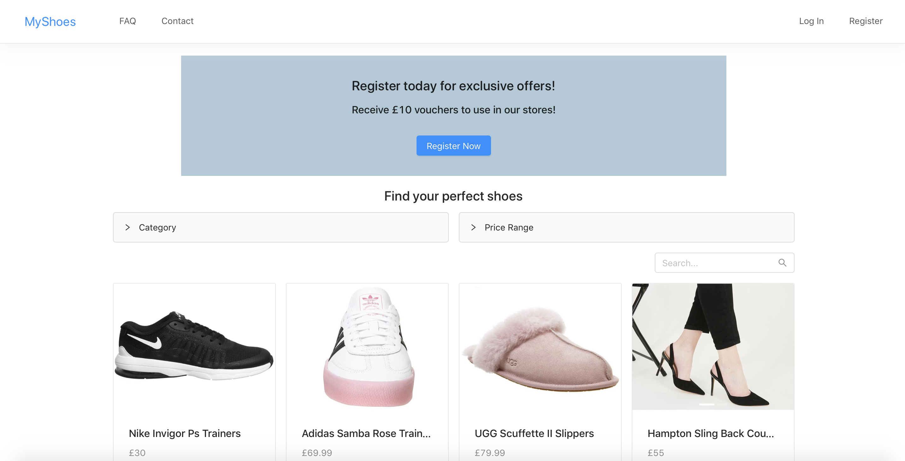

# MyShoes online shop

Ecommerce app using React, Redux, Node, Express and MongoDB.

Using antd for UI.

Functionality implemented:
* display items and filter by category/price
* search items
* login/registration (pop-up for unregistered users)
* upload new items for admin
* add to cart for items only in stock
* history of orders
* tracking page for last order

## How to launch
* 'npm install' inside root directory (download server dependencies) 
* 'npm install' inside the client directory (download front-end dependencies)
* 'npm run dev' inside root directory
